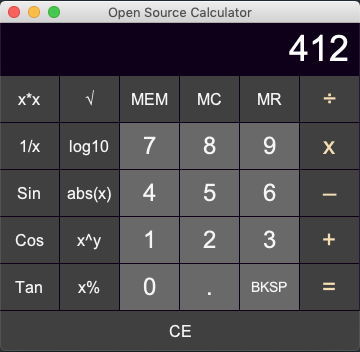

# Simple Java Calculator

# Simple Java Calculator

Welcome to our fork of Simple Java Calculator!

## Our Purpose

* Learn about Open-Source Software through active participation.
* Improve OOP skills by focusing on a simple Java app.
* _It’s a team effort._ We adopted many techniques commonly used by OSS projects, including the GitFlow branching model, GitHub pull requests, code review, and more. This is our chance to see what works (and what doesn't) and learn how to work effectively as a team.

## What We’ve Been Up To

### August 6, 2019 Changelog

* Added dark theme.
* Made calculator resizable.
* Rearranged buttons to match standard 10-key layout.
* Added keyboard functionality (type on keyboard).
* Added memory store (MEM), memory clear (MC), memory recall (MR), and backspace (BKSP) buttons.
* Added Clear (CE) button to clear the display.
* Implemented supported field input for `0`, `1`, `2`, `3`, `4`, `5`, `6`, `7`, `8`, `9`, `/`, `*`, `-`, `+`, `=`, `.`, and other buttons.
* Updated calculator title and icon.
* Prompt to quit feature added.
* Fixed bug with equals "=" key where no input was displayed.
* Added JUnit tests.
* Added Javadoc.
* Added CODE_OF_CONDUCT and CONTRIBUTING documents.
* Updated README.

### Original Calculator

### New Calculator

## From the Original Author

This project was originally written using Eclipse, but I have migrated it to NetBeans.
This calculator is simple with an easy code to help novices learn how to create a calculator program with Java.

If you use the executable "SimpleJavaCalculator.jar" file and that doesn't work, you can type `java -jar /your_calculator_directory/SimpleJavaCalculator.jar` in your terminal.

**You might also like my [Simple Java Text Editor](https://github.com/pH-7/Simple-Java-Text-Editor).**

## AUTHOR

### Base Application

**[Pierre-Henry Soria](http://ph7.me)**

### Modifications and Improvements

[Achintha Gunasekara](http://www.achinthagunasekara.com)

## CONTACT

Pierre-Henry SORIA: pierrehs [AT] hotmail [D0T] com

Achintha Gunasekara: contact [AT] achinthagunasekara [D0T] com

## LICENSE

Apache License, Version 2.0 or later; See the LICENSE.txt file.
